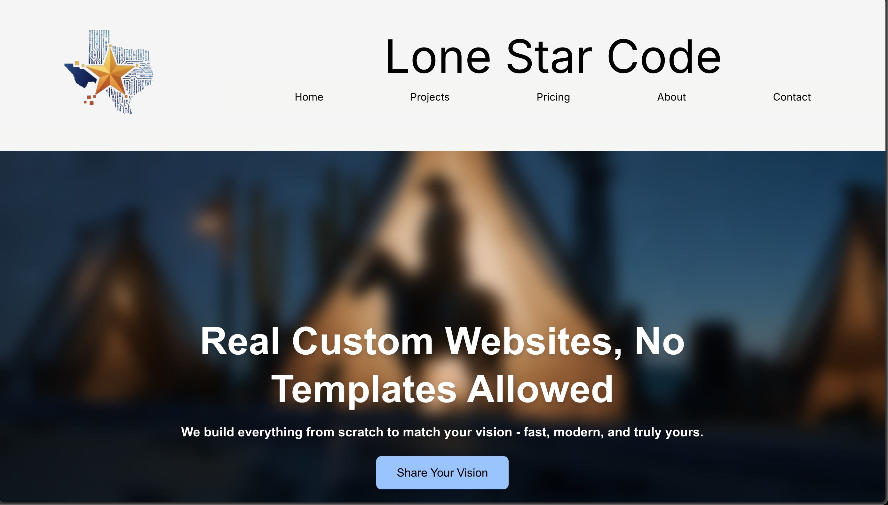

# ⭐ Lone Star Code

**Lone Star Code** is a modern web development studio based in Texas, focused on building fast, elegant, and scalable websites and applications for small businesses, startups, and local entrepreneurs.

We combine technical expertise with personalized service to help you turn your idea into a powerful digital product.

## 🌐 Live Site

[www.lonestarcode.net](https://www.lonestarcode.net)

## 🧰 Tech Stack

- Next.js (App Router)
- React
- TypeScript
- Tailwind CSS
- ShadCN UI
- Framer Motion
- Vercel (Hosting)

## 💼 Services Offered

- Custom Websites
- E-commerce Stores
- Admin Dashboards
- Booking Systems
- AI Integrations (OpenAI, DeepSeek)
- CV/ATS Optimization Tools

## 📸 Screenshots




## ⚙️ Local Development

```bash
git clone https://github.com/yourusername/lonestarcode.git
cd lonestarcode
npm install
npm run dev